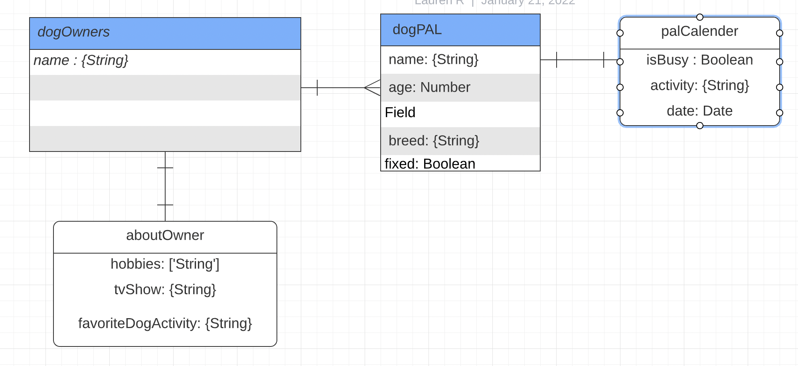

# Coding-PAL-s
## About Our Website
Its a website all about our Dogs! Follow us on our coding journey with our dogs. This website will showcase our loving dogs and give a brief insight into who we are. 

## Wireframe

## User Stories
What is Coding PAL's? 

As a user you will start at the home page and see your favorite Coding PAL and their dog(s). From there you can select what you would like to know more about, the Coding PAL or their fury friend. In the Coding PAL link you will find a brief profile about the PAL and a link to their dog. Users will be able to learn more about our pets and their daily lives. This will include pictures of our dogs, their schedules, their friends, and whatever else a dog does. 

In later interations, we would like to open our website to all of our Purple Lavendeer friends to add their pets!

## MVP Goal List

Create models views controllers and other files containers (file structure)
Have server.js coded and linked decently
Have routes built and in controllers file
Have home page designed and linked to other pages properly
Have dogs show prole page with 1 picture with descriptins
Have the owner profiles with 1 picture and description
Have a consistent coding style throughout the project

## Stretch Goals
Picture carousels on the home page for dogs and style the home page more
Add bone and like counter to dog profile and style to look similar to a dating app
Add new page for dog pictures and maybe a database for them to store the like count
Add a login feature to make new pal accounts to use the CRUD feature more
Utilize firehydrants throughout website design
Mobile device friendly
Mouse to be a pawprint
Have calendar to see what special activities the dogs have planned

## Database ERD Diagram

## RESTful Routes

